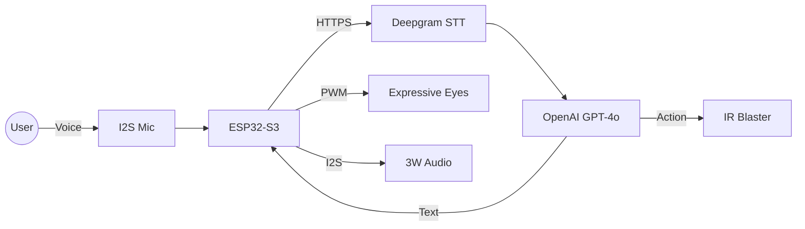

# 🤖 Mochi: The Table Assistant Robot

**Mochi** is a portfolio-grade, ESP32-S3 based table assistant designed to be more than just a smart speaker. It features expressive OLED animations, voice-controlled AI intelligence, and the ability to physically control your environment via a high-precision Infrared (IR) engine.

## 🚀 Key Features

- **Local Wake-Word Detection**: **"Hey Mochi"** is detected locally on the ESP32-S3 using ESP-SR/WakeNet. No audio is streamed to the cloud until the wake-word is heard, ensuring maximum privacy.
- **Expressive Personality**: Animated eyes on an SSD1306 OLED that blink, pulse when listening, and spin when thinking.
- **Cloud-Powered Intelligence**: Secure integration with OpenAI's GPT-4o-mini for conversational logic.
- **Speech-to-Text**: High-speed voice recognition powered by Deepgram's Nova-2 model.
- **Smart Remote Control**: Advanced IR transmission using the ESP32-S3's RMT peripheral, capable of controlling Panasonic Shinobi Pro TVs and other legacy IR devices.
- **Privacy First**: Secure WiFi connectivity with Root CA certificate validation for all cloud requests.
- **Modular Hardware**: Dedicated I2S pipeline for high-quality audio capture and playback.

---

## 🛠 Hardware Requirements

- **Microcontroller**: ESP32-S3 (N16R8 variant recommended for PSRAM)
- **Display**: 0.96” SSD1306 OLED (I2C)
- **Microphone**: INMP441 I2S Digital Microphone
- **Amplifier**: MAX98357A I2S Mono Amp + 3W Speaker
- **IR Transmitter**: High-power 940nm IR LED with transistor driver (MOSFET or 2N2222)
- **Power**: 5V USB-C or LiPo battery with proper regulation

---

## 📂 Project Structure

```text
firmware/desk_robot/
├── desk_robot.ino    # Main state machine and initialization
├── config.h          # Pin definitions, WiFi, and API keys
├── oled_engine.h     # Expressive animation logic
├── cloud_client.h    # HTTPS, STT, and LLM integrations
├── ir_engine.h       # RMT-based IR transmission & NVS storage
└── audio_pipeline.h  # Low-level I2S DMA handling
```

---

## 🚦 Getting Started

### 1. Prerequisites
- Install **Arduino IDE** or **VS Code + PlatformIO**.
- Install the following libraries:
    - `Adafruit SSD1306` & `Adafruit GFX`
    - `ArduinoJson`
    - `IRremoteESP8266`

### 2. Configuration
Open `firmware/desk_robot/config.h` and update the following:
```cpp
const char* WIFI_SSID = "YOUR_SSID";
const char* WIFI_PASS = "YOUR_PASSWORD";
const char* OPENAI_API_KEY = "YOUR_OPENAI_KEY";
const char* DEEPGRAM_API_KEY = "YOUR_DEEPGRAM_KEY";
```

### 3. Pin Mapping
The default mapping is optimized for the ESP32-S3:
- **OLED**: SDA (8), SCL (9)
- **I2S Mic**: SCK (41), WS (42), SD (2)
- **I2S Amp**: BCLK (5), LRCK (6), DIN (7)
- **IR TX**: GPIO 10

---

## 🧠 System Architecture



## 📈 Future Roadmap

- [ ] **OTA Updates**: Over-the-air firmware updates via a web dashboard.
- [ ] **Wake Word**: Local wake-word detection using ESP-SR.
- [ ] **Mobile App**: Bluetooth/WiFi companion app for custom IR command training.
- [ ] **3D Enclosure**: Custom-designed housing with articulating ears/head.

---

## 📄 License
This project is open-source and intended for educational and portfolio purposes.
